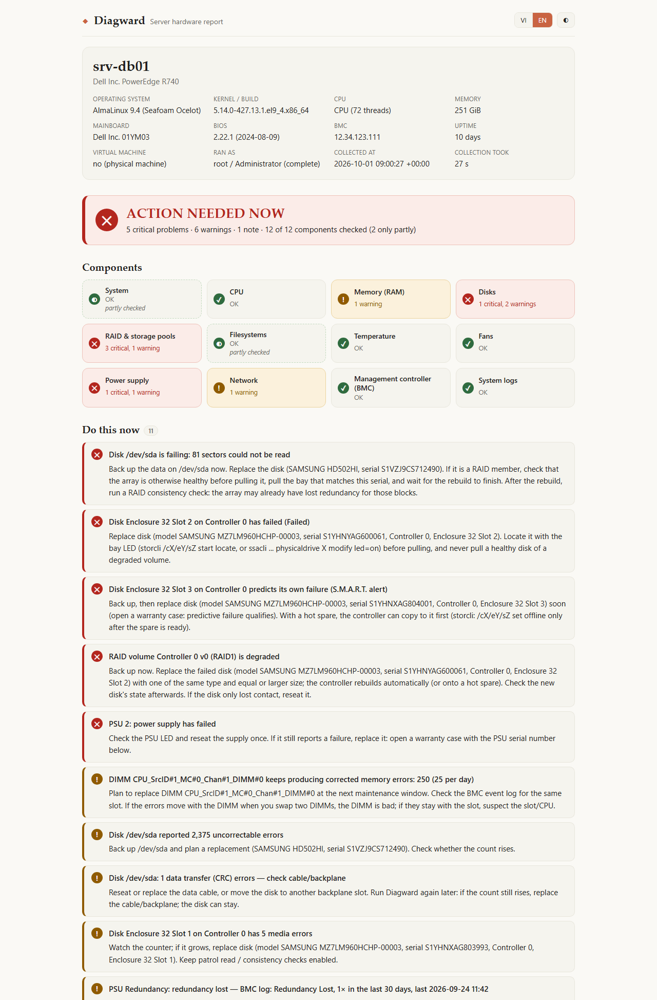
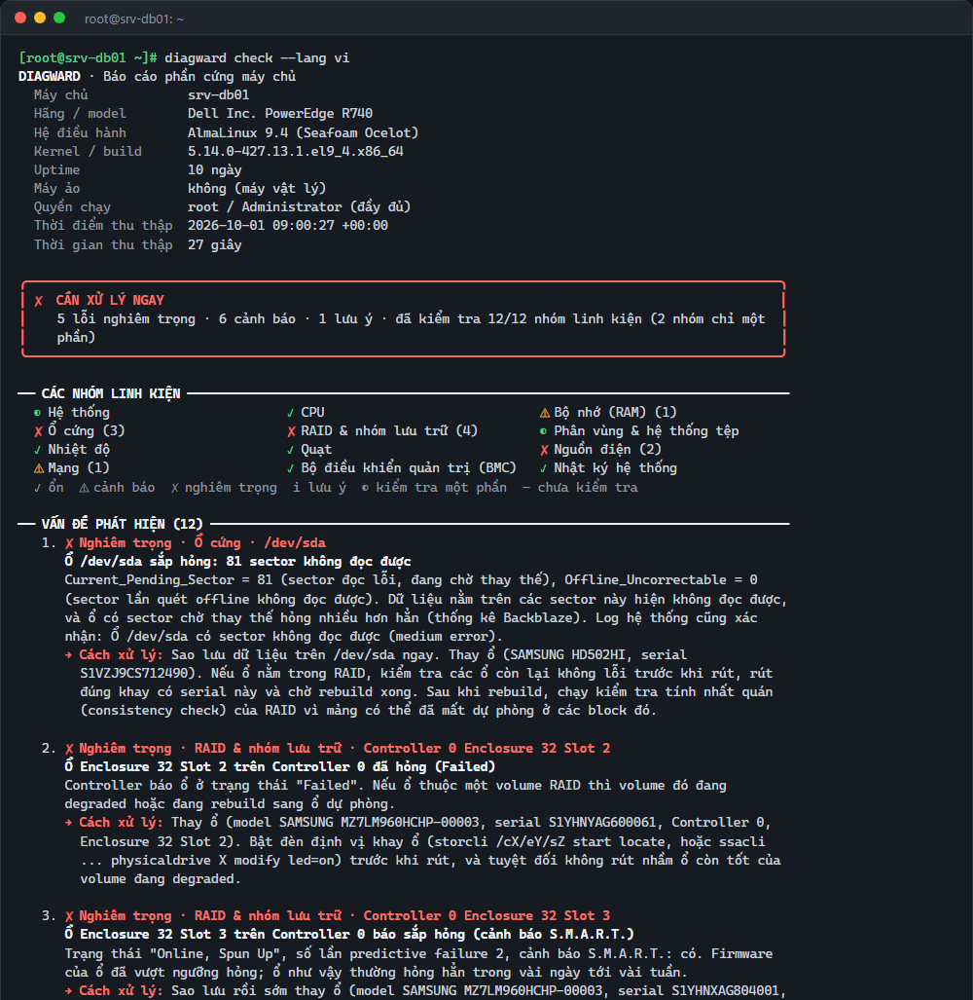
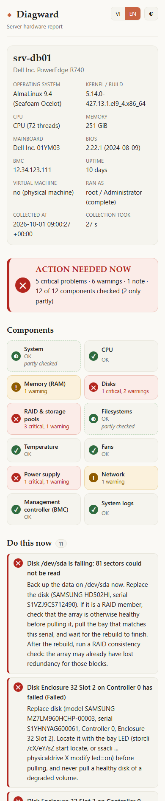
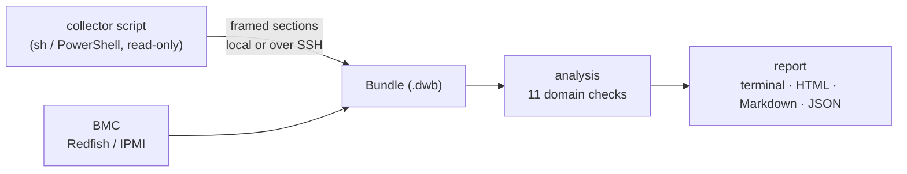

<h1 align="center">Diagward</h1>

<p align="center">
  <b>Server hardware diagnosis for IT support.</b><br />
  One command checks disks, RAID, RAM, CPU, temperatures, fans, power supplies, the BMC,
  network cards and the system logs — then explains every problem, says what to do,
  and lists the serial numbers you need for the warranty case.<br />
  Linux and Windows Server. Vietnamese and English. Free and open source.
</p>

<p align="center">
  <a href="https://github.com/nguyenquocanhz/diagward/actions/workflows/ci.yml"></a>
  <a href="LICENSE"></a>
</p>

<p align="center">
  
</p>

## Why

When a server is slow, freezes or reboots by itself, the usual checklist is
long: `smartctl -a` on every disk, `cat /proc/mdstat`, `memtester`,
`sensors`, `mcelog`, `ipmitool sel list`, the kernel log, the controller's
own CLI… and then knowing what each number means. Diagward runs all of it,
reads the output the way an experienced engineer would, and writes a report
a customer or a hardware vendor can read.

- **Explains, not just dumps.** "Disk /dev/sda is failing: 24 sectors could
  not be read. Back up now, replace the disk (serial ZA1234); if it is in a
  RAID, wait for the rebuild before pulling it."
- **Honest about coverage.** Every check says whether it ran, and if not,
  why and the exact command that enables it (`dnf install -y smartmontools`).
- **Safe.** The collector only reads. Nothing is installed or changed unless
  you ask (`install-tools`, `--bench`, `--memtest`).
- **One static binary.** No agent, no dependencies; the helper tools it can
  use (smartctl, ipmitool, …) are optional.

<p align="center">
  
  &nbsp;
  
</p>

<sub>The screenshots show a demo Dell PowerEdge R740 assembled from real tool
outputs (`go run ./internal/devtools/demo`); the bundle and both reports are
in [docs/demo](docs/demo).</sub>

## What it checks

| Component | Linux | Windows |
|---|---|---|
| **Disks** | S.M.A.R.T. for SATA, SAS and NVMe (also behind MegaRAID/PERC/Smart Array), wear, pending/reallocated sectors, self-tests, smartd, optional `dd` speed test | Storage health, reliability counters, failure prediction, smartctl if installed |
| **RAID** | mdadm, ZFS, Btrfs, LVM RAID, storcli/perccli, ssacli, arcconf, MegaCli; detects controllers whose CLI is missing | Storage Spaces, vendor CLIs |
| **Memory** | DIMM inventory, ECC errors per DIMM (EDAC, rasdaemon), DIMMs missing after POST, memory pressure, optional `memtester` | DIMM inventory, ECC capability, Windows Memory Diagnostic results |
| **CPU** | Machine-check errors (rasdaemon, mcelog), thermal throttling, CPUs disabled by BIOS | CPUs disabled by BIOS, WHEA errors |
| **Temperature, fans, power** | lm-sensors / hwmon, IPMI sensors (SDR), PSU status and redundancy | ACPI thermal zones, LibreHardwareMonitor, IPMI if available |
| **BMC** | IPMI event log (SEL), chassis status, BMC address | same through ipmitool, or `diagward bmc` |
| **Network** | Link, speed/duplex mismatches, CRC errors, flapping, bonding redundancy | Adapters, errors, NIC teaming |
| **Filesystems** | Space and inodes, read-only remounts, ext4 errors, missing mounts | Volume health, low space, dirty bit |
| **Logs** | Kernel log patterns for disks, controllers, ECC, MCE, PCIe AER, lockups, OOM, link loss; unexpected reboots; kernel crash dumps | System event log: WHEA, disk/NTFS errors, BSOD stop codes, unexpected shutdowns |
| **Out of band** | `diagward bmc` reads Dell iDRAC, HPE iLO, Lenovo XClarity, Supermicro and OpenBMC over Redfish (or IPMI over LAN) — for servers that hang or will not boot | same |

Virtual machines and containers are recognised: Diagward then says that
hardware checks belong on the host instead of raising false alarms.

## Install

**Linux** (x86_64 and arm64):

```bash
curl -fsSL https://raw.githubusercontent.com/nguyenquocanhz/diagward/main/install.sh | sudo sh
```

**Windows**: download `diagward-windows-amd64.exe` from
[Releases](https://github.com/nguyenquocanhz/diagward/releases), right-click →
*Run as administrator*. Double-clicking it runs a check and opens the HTML
report in your browser.

macOS builds are available for `diagward bmc` and `diagward analyze`.

## Use

```bash
sudo diagward                          # check this server, report in the terminal
sudo diagward --lang vi                # in Vietnamese (or set DIAGWARD_LANG=vi)
sudo diagward check --html srv01.html  # plus a self-contained HTML report
sudo diagward check --md -             # Markdown for a ticket or a chat message
sudo diagward install-tools            # install smartctl, sensors, ipmitool... (asks first)
```

**A customer's server you cannot log into?** Ask them to run
`sudo diagward collect -o srv01.dwb` (or double-click on Windows and send the
file), then analyse it on your laptop: `diagward analyze srv01.dwb --html srv01.html`.

**A server that hangs or will not boot?** Read its BMC from the network:

```bash
diagward bmc 10.0.0.15 --user root            # asks for the password
DIAGWARD_BMC_PASSWORD=... diagward bmc idrac-srv01.lan --user root --insecure
```

**Monitoring.** `diagward check -q` prints one line and exits with 0 (OK),
1 (warning), 2 (critical) or 3 (error), so it drops into cron, Nagios or
Zabbix as is.

**Alerts from the server itself.** Run it from cron, a systemd timer or Task
Scheduler with `--notify-config /etc/diagward/notify.conf` and it messages
**Telegram, Zalo Bot, Slack, Discord, a webhook or e-mail** — only when
something changes (a new or worse problem, or a recovery). `diagward
notify-test` checks the setup. See [docs/notify.md](docs/notify.md).

**Active tests (opt-in).** `--bench /var/tmp` writes and reads back a test
file to measure disk speed; `--memtest 2G` runs `memtester`. Both add load:
run them in a maintenance window.

Reports contain hardware inventory, serial numbers, hostnames and log lines;
review them before sending them outside your organisation. See
[SECURITY.md](SECURITY.md).

### In Termward

[Termward](https://github.com/nguyenquocanhz/termward), the SSH manager,
runs the same check over its SSH connections: open a server and press
**Check hardware**.

## How it works



The collector prints raw command output in framed sections; nothing is
interpreted on the server. The analysis runs anywhere and can be re-run on a
saved bundle. See [docs/ARCHITECTURE.md](docs/ARCHITECTURE.md).

## Build from source

Requires Go 1.26+.

```bash
git clone https://github.com/nguyenquocanhz/diagward
cd diagward
go test ./...
go build -o diagward ./cmd/diagward
```

Real outputs from faulty hardware make the rules better: see
[CONTRIBUTING.md](CONTRIBUTING.md) for how to share a sample.

---

## Tiếng Việt

**Diagward** là công cụ kiểm tra phần cứng máy chủ dành cho dân IT support.
Một lệnh là kiểm tra hết ổ cứng (S.M.A.R.T.), RAID, RAM (ECC), CPU, nhiệt độ,
quạt, nguồn, BMC, card mạng và log hệ thống; giải thích từng lỗi bằng tiếng
Việt, nói rõ cần làm gì, và liệt kê serial linh kiện để mở ca bảo hành.
Chạy trên Linux (AlmaLinux, Rocky, CentOS, Ubuntu, Debian, Proxmox) và
Windows Server.

- **Tự động làm hết các bước kiểm tra thủ công:** `smartctl`, `/proc/mdstat`,
  `memtester`, `sensors`, `mcelog`/`rasdaemon`, `ipmitool sel`, log kernel,
  công cụ của card RAID (storcli, perccli, ssacli)…
- **Kết luận rõ ràng:** "Ổ /dev/sda sắp hỏng: 24 sector không đọc được. Sao
  lưu dữ liệu ngay, thay ổ (serial ZA1234)…"
- **Nói thật mục nào chưa kiểm tra được** và lệnh để bật nó.
- **An toàn:** chỉ đọc, không cài hay sửa gì trừ khi bạn yêu cầu.
- **Báo cáo HTML** gửi khách hoặc gửi hãng (chuyển Việt/Anh ngay trong
  file), **Markdown** để dán vào Zalo/Telegram/ticket.

**Cài trên Linux:**

```bash
curl -fsSL https://raw.githubusercontent.com/nguyenquocanhz/diagward/main/install.sh | sudo sh
sudo diagward --lang vi
```

**Windows:** tải `diagward-windows-amd64.exe` ở mục
[Releases](https://github.com/nguyenquocanhz/diagward/releases), chuột phải →
*Run as administrator*; bấm đúp sẽ tự kiểm tra và mở báo cáo HTML.

**Các tình huống hay gặp:**

| Tình huống | Lệnh |
|---|---|
| Kiểm tra nhanh máy đang đăng nhập | `sudo diagward --lang vi` |
| Xuất báo cáo gửi khách | `sudo diagward check --html srv01.html` |
| Cài công cụ còn thiếu (smartctl, sensors, ipmitool…) | `sudo diagward install-tools` |
| Khách tự chạy rồi gửi file | khách: `sudo diagward collect -o srv01.dwb` · bạn: `diagward analyze srv01.dwb` |
| Máy treo, không vào được hệ điều hành | `diagward bmc <IP iDRAC/iLO> --user root` |
| Đo tốc độ ổ / test RAM (giờ bảo trì) | `sudo diagward check --bench /var/tmp` · `sudo diagward check --memtest 2G` |
| Giám sát định kỳ (cron, Zabbix) | `diagward check -q` (mã thoát 0/1/2/3) |
| Tự báo lỗi qua Telegram, Zalo Bot, Slack, Discord, email (chạy bằng cron) | `diagward check -q --notify-config /etc/diagward/notify.conf` — xem [docs/notify.md](docs/notify.md) |

Đặt `DIAGWARD_LANG=vi` để luôn dùng tiếng Việt.

## License

[MIT](LICENSE)
